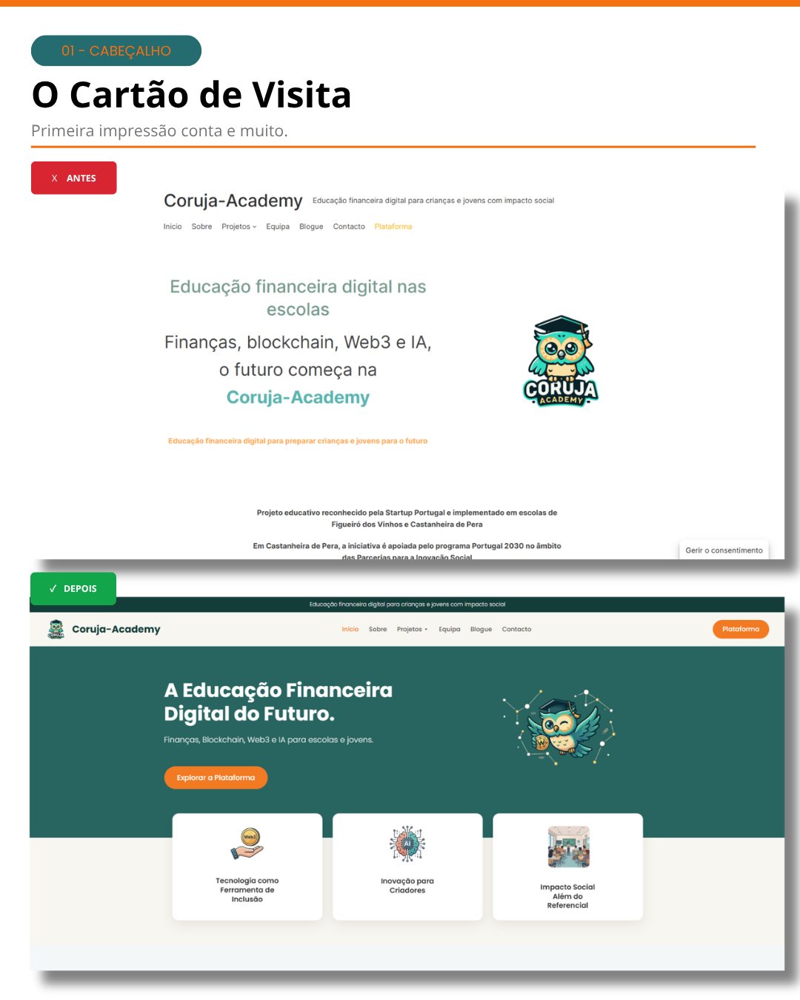
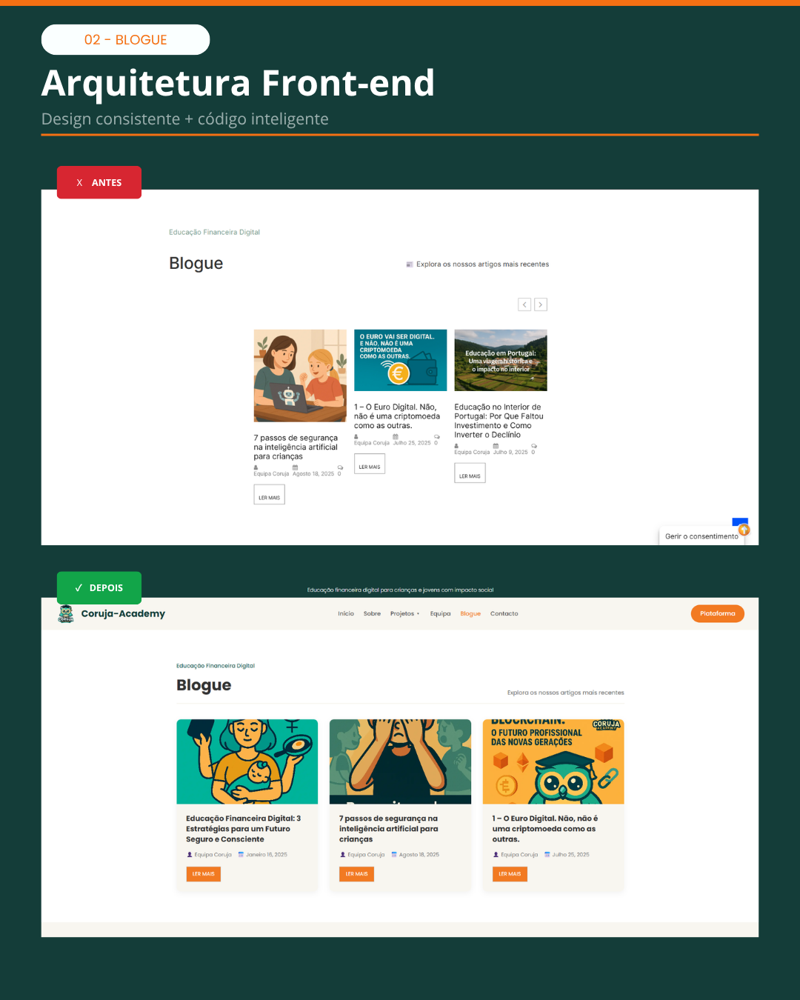
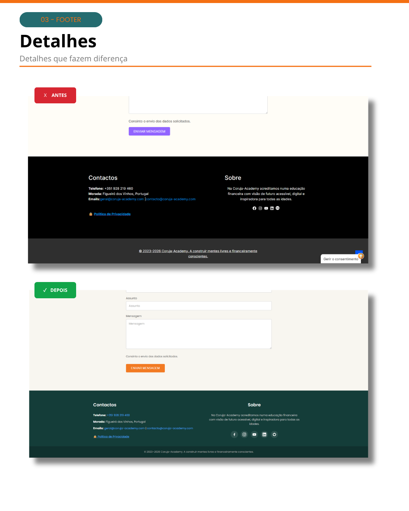

# 🦉 Concept Redesign: Coruja-Academy

🚀 **Live Demo:** [https://tthheodoro.github.io/coruja-academy-rework](https://tthheodoro.github.io/coruja-academy-rework/)

## O Antes e o Depois

*(Coloca aqui as imagens na pasta do teu repositório e usa este código para as mostrar)*

---

## 1. O Desafio e o Propósito

A Coruja-Academy é um projeto inovador nascido em Figueiró dos Vinhos, focado em literacia financeira, Web3, Blockchain e Inteligência Artificial para jovens. Sendo uma iniciativa ligada ao futuro da tecnologia, o desafio foi criar uma interface (UI) que refletisse essa vanguarda digital, mantendo a confiança e clareza exigidas por um projeto educativo e institucional.

**O Problema do site original:**
* Design pesado com excesso de bordas escuras que criavam "ruído" visual.
* Navegação estática e repetitiva (falta de modularidade).
* Falta de hierarquia clara na leitura dos conteúdos institucionais.
* Ausência de micro-interações que tornassem a navegação envolvente.

---

## 2. UI / UX: A Construção da Identidade Visual

Não mudei as coisas apenas por estética. Cada decisão de design teve um propósito técnico e psicológico:

### 🎨 Paleta de Cores (A Regra do 60-30-10)
Usei variáveis CSS nativas (`:root`) para criar um sistema de cores consistente:
* **Fundo (`#F8F6F0` Bege Claro):** Substituiu o branco puro para reduzir o cansaço visual (*Eye Strain*), criando um ambiente de leitura confortável.
* **Cor Primária (`#2A6A65` Teal) & Secundária (`#143D39` Dark Teal):** Tons associados a crescimento, estabilidade financeira e instituições de ensino.
* **Acento/CTA (`#F27A22` Laranja):** Usado estrategicamente em botões e *hover states* para chamar a atenção (*Call-to-Action*) e transmitir a energia e juventude dos alunos.

### 🔤 Tipografia
* **Família Escolhida:** Poppins (Google Fonts).
* **Porquê?** É uma fonte geométrica sem serifa (*sans-serif*). É altamente legível em ecrãs pequenos, moderna o suficiente para o tema "Tech/Web3", mas com um aspeto amigável e arredondado que se adequa a crianças e jovens.

### 🧩 Componentes e Micro-interações
Desenvolvi cartões (*Cards*) com sombras suaves (`box-shadow`) em vez de bordas sólidas, dando uma sensação de elevação e leveza. Adicionei micro-interações em CSS puro (ex: a barra laranja que desliza e o ícone que se inclina ao passar o rato), recompensando a curiosidade do utilizador e melhorando a retenção na página.

---

## 3. Arquitetura de Informação & User Flow

Em vez de repetir o mesmo cabeçalho e rodapé em vários ficheiros (o que não é escalável), adotei princípios de Engenharia de Software como o **DRY (Don't Repeat Yourself)**.

* **CSS Modular:** Separei a lógica em `_variables.css` (para o tema), `global.css` (para a estrutura base, menu e footer) e ficheiros específicos para cada página (`academy.css`, `blogue.css`). Isto facilita imenso a manutenção futura do código.
* **Simulação de SPA (Single Page Application):** Para a área de Artigos e Projetos, em vez de criar múltiplos ficheiros HTML, criei uma "Base de Dados" simulada em **JavaScript Vanilla**. Usando *Query Strings* no URL (`?id=sobre`), o JavaScript injeta dinamicamente o título, imagens e texto no template, poupando centenas de linhas de código.

---

## 4. Tech Stack: Porquê "Vanilla"?

*(As ferramentas que usei e porquê)*

* **HTML5 Semântico:** Uso rigoroso de tags como `<main>`, `<article>`, `<section>` e `<nav>` para garantir que os motores de busca (SEO) e os leitores de ecrã interpretam a página corretamente.
* **CSS3 Puro (Flexbox & Grid):** Criei um layout 100% responsivo sem tocar no Bootstrap ou Tailwind. O `CSS Grid` foi fundamental para as grelhas de artigos e o `Flexbox` para o alinhamento de componentes e construção do Menu Hamburger mobile.
* **Vanilla JavaScript:** Manipulação do DOM e eventos sem o peso do React ou jQuery.

---

## 5. Performance e Acessibilidade (a11y)

Como é um projeto de impacto social, a inclusão não é opcional, é obrigatória.

* **Navegação por Teclado:** Implementei o `focus-visible` com uma outline laranja tracejada, permitindo que utilizadores com limitações motoras naveguem perfeitamente pelo site apenas com a tecla `TAB`.
* **Leitores de Ecrã:** Adicionei atributos `aria-expanded`, `aria-controls` e `aria-label` aos botões interativos e ao Menu Mobile, garantindo que o estado da interface é comunicado a invisuais.
* **Ícones em SVG:** Removi os ficheiros PNG pesados das redes sociais e substituí-os por `SVGs` embutidos (*inline*), reduzindo o número de pedidos HTTP (*HTTP Requests*) e garantindo uma resolução perfeita (*crisp*) em ecrãs Retina, sem penalizar o tempo de carregamento.
